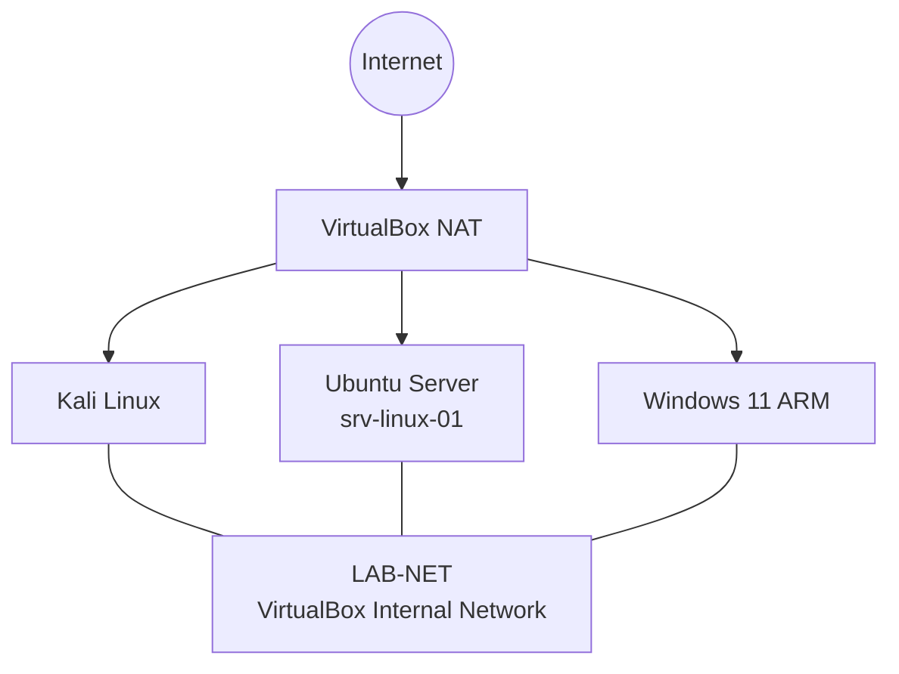

# HomeLab v1 Diagram

## Network Model

Each virtual machine has two network adapters:

    Adapter 1 → NAT
    Adapter 2 → LAB-NET

NAT is used for Internet connectivity.

LAB-NET is used for isolated communication between HomeLab systems.
